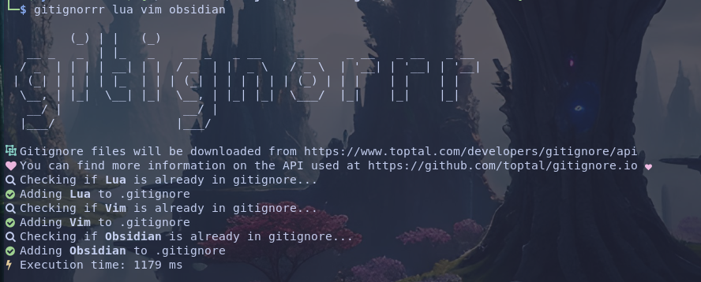

# GitignorRR

## 🔭 Description

Gitignorrr is your next favorite tool for managing .gitignore files. It's a powerful, dynamic, and user-friendly command-line application designed to simplify the process of generating and maintaining .gitignore files for all of your projects.



## 🚧 Work in progress

It's not a stable project for now.

## 🌠 Features

- Dynamic Generation: Gitignorrr fetches the most recent .gitignore templates from the well-curated database at gitignore.io.
 
- Multiple Language Support: Gitignorrr can handle multiple languages at once, providing comprehensive .gitignore files that are tailor-made for your multi-language projects.
 
- No Redundancies: If a language or platform is already listed in your .gitignore file, Gitignorrr will not add it again. 
 
- Interactive Listing: With Gitignorrr, you can list all the languages and platforms currently covered in your .gitignore
 
- Zsh Completion: For Zsh users, Gitignorrr offers command-line completion.
 
- Easy Installation

- Custom Template : You can modify the file `/usr/share/bin/Gitignorrr` to include your own custom template

## 🔲 Dependencies

It's a basic bash util that use common Unix Programs.
It need : `curl sed grep awk git zsh tr date`

Im using latest nerdfonts version 3.0 on my system so icons might not work with older version.

It's calling gitignor.io to download the files so it obviously require internet access.

## ▶️  Installing

To download `gitignorrr` to `/usr/local/bin`:

```bash
sudo curl -Lo /usr/local/bin/gitignorrr https://raw.githubusercontent.com/PaysanCorrezien/GitignorRR/main/gitignorrr
sudo chmod +x /usr/local/bin/gitignorrr
command -v gitignorrr >/dev/null 2>&1 && echo "gitignorrr is successfully installed " || echo "gitignorrr is not installed or not in the PATH"
```
To add Zsh completion to `.zshrc`:

```bash
curl -o- https://raw.githubusercontent.com/PaysanCorrezien/GitignorRR/main/zshcompletion >> ~/.zshrc
```

Restart your shell or run `source ~/.zshrc` to refresh Zsh completion.

You can check if Zsh completion was added successfully to `.zshrc` with this command:

```bash
grep -q "source $(pwd)/zshcompletion" ~/.zshrc && echo "Zsh completion for gitignorrr added successfully to .zshrc" || echo "Zsh completion for gitignorrr was not added to .zshrc"
```

Verify if /usr/local/bin is in your path :
```bash
echo $PATH | grep -q "/usr/local/bin" && echo "/usr/local/bin is in the PATH" || echo "/usr/local/bin is not in the PATH"

```

## 🚀 Executing program

Use `gitignorrr` and pass a list of program / language with a space between them
```
gitignorrr phpstorm obsidian Linux
```
If you install the autocompletion snippet just type the first letter and press Tab and if should autocomplete, if you have autocompletion for zsh enabled.

## 📆 ToDo

- [ ] Show list of all languages available for gitignore (list from gitignore.io /api/list )
- [ ] Cover errors
- [ ] Improve Installation process
- [ ] Find better way to manage completion and refresh of the list ( without function in zshrc )


## 🆘 Help

```
gitignorrr -h
```

## 🤺 Author

Dylan Meunier [@PaysanCorrezien](https://github.com/PaysanCorrezien)

## 💻 Version History

* 0.1
    * Initial Release

## 📚 License

This project is licensed under the [MIT] License - see the LICENSE.md file for details

## ♥️ Acknowledgments

* [gitignore.io](https://github.com/toptal/gitignore.io)
* [fakeyanss](https://github.com/toptal/gitignore.io/issues/586)

